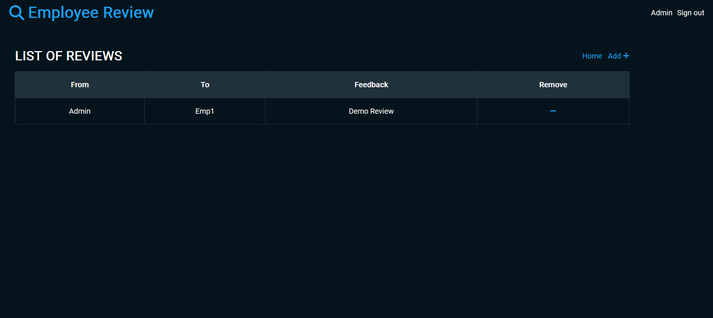

# Employee Review System
An employee review app backend using nodeJS

## how to setup
<code>npm install</code> to install the libraries found in package.json

## run the app
npm start 
or
<code>node index.js</code>

## Find the demo on site - please give a bit time to load
<a href="https://employee-review-jh1l.onrender.com/"> Hosted Link here </a>

## Features to the site
- Sign in / Sign up

- Admin home page view

- Add/remove/update/view employees

- Add/update/view performance reviews

- Assign employees to participate in another employee's performance review

- Employee home view

- List of performance review requiring feedback

- An employee can register, but only admin can make an employee an admin
